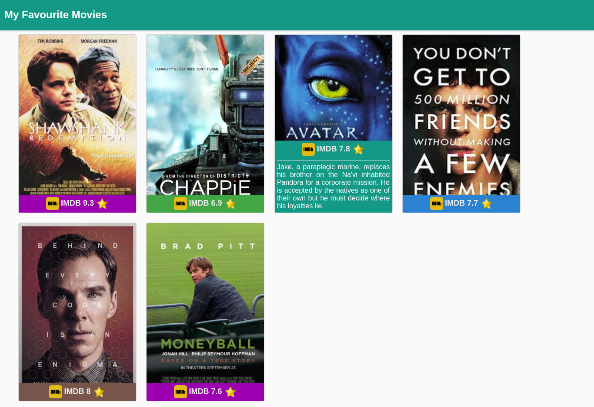
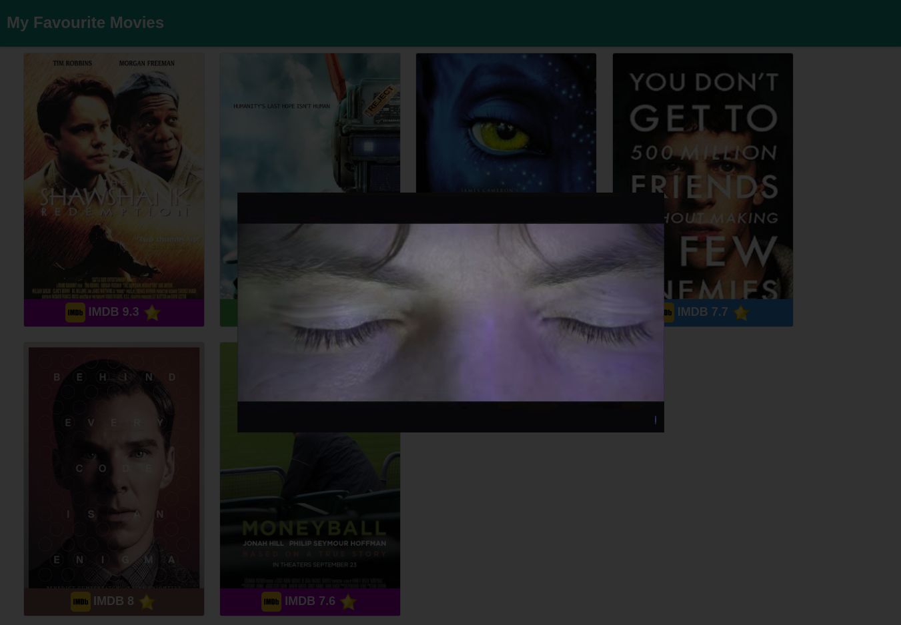

# What this Repo Contains?
Some mini projects for python foundations course from udacity.
# How to clone this repo ?
`git clone https://github.com/AByteCoder/python-udacity.git`
# Mini Project-2 [Sierpinski Gasket](mini_project2) using turtle
This project was created to draw a 2d Sierpinski Gasket.
## How to run it?
```
cd mini_project2
python turtle_sgasket.py
```
## Screenshot

# Mini Project-4 [Movie Trailer](mini_project4)
```
cd mini_project4
python fav_movies.py fav_movies.json fav_movies.html```

The first paramenter to the program is a [JSON](http://www.json.org/) [file](mini_project4/fav_movies.json) it contains data about the movies.

The Second Parameter (optional) is used to tell the output html file name. It defaults to index.html by default.

## Screenshots



